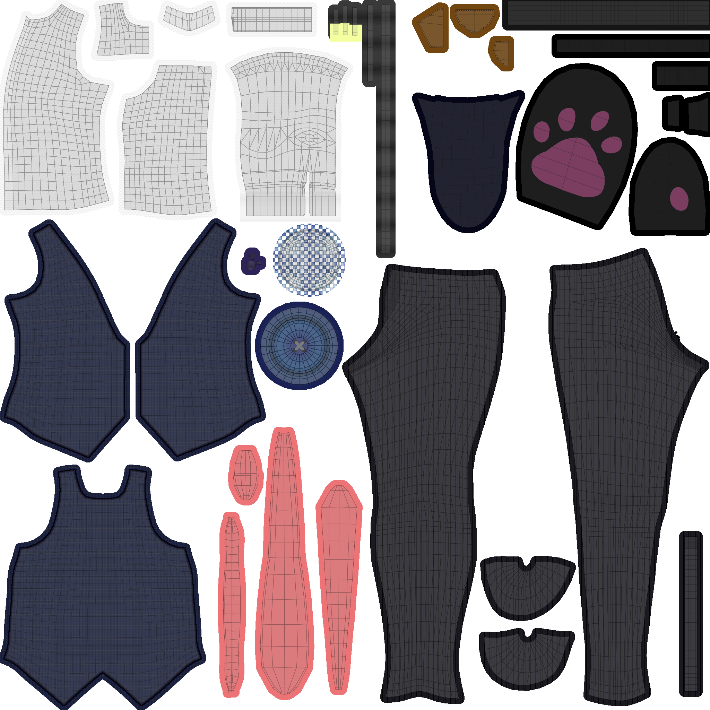
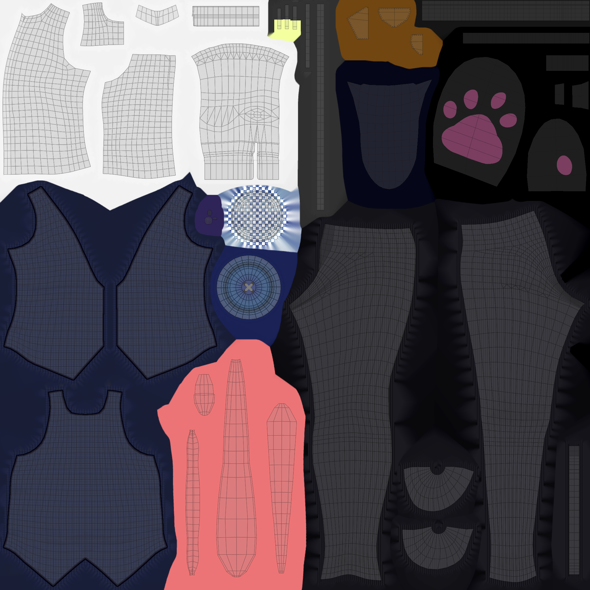

# このツールについて
マスク指定された画像領域を高速に塗りつぶすツールです。
3DCG用のテクスチャのパディング領域の塗りつぶし等に用いることが出来ます。



↓



# 使い方
inpaint --src 入力画像 --mask マスク画像 --dst 出力画像

## 入力画像
RGB画像もしくはRGBA画像を入力します。
RGBA画像が入力された場合、RGBチャネルのみがinpaintされ、アルファチャネルは変化しません。

## マスク画像
1ch, 3ch, 4chの画像を入力出来ます。
- 1chの場合、黒画素の領域が塗りつぶされます。
- 3chの場合、黒画素の領域が塗りつぶされます。
- 4chの場合、4チャネル目（アルファチャネル）が黒画素の領域が塗りつぶされます。

## 出力画像
塗りつぶされた画像の出力先を指定。

## inpaintRGBA.bat
windowsで動作するバッチファイル(inpaintRGBA.bat)を用意してあります。
RGBチャネルの塗りつぶしたい領域のアルファが0の画像をD&Dで指定します。

# ビルド方法
## 必要環境
- cmake >= 3.12
- compiler (Visual C++等)

## ビルド手順

### OpenCVのビルド
次のコマンドを実行
```
cmake -P build_opencv.cmake
```
build_opencvディレクトリにビルドされます。

### inpaintのビルド
```
cmake -P build_inpaint.cmake
```
buildディレクトリにビルドされます。